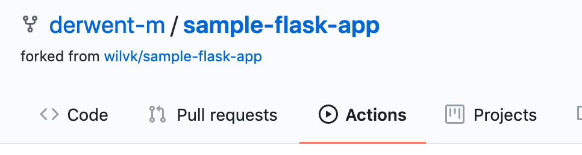

# Exercise 3 - CI/CD

This repository has a GitHub Action workflow in `.github/workflows/lint_test.yml`. This file tells
GitHub what to do each time a commit / pull request is submitted. In this example, we're simply
running `flake8` inside the `web` docker container.

In this exercise, we will modify this repository's workflows to add a second workflow definition
which automatically scans the repo with Hawkeye.

You can read more about GitHub workflow definitions
[here](https://docs.github.com/en/actions/reference/workflow-syntax-for-github-actions)

## Prerequisites

If you haven't already done so, you will need to follow the [Setup Instructions](00_setup.md) before
continuing

## Create the workflow definition

Go to `.github/workflows` and create a new workflow file `hawkeye.yml`

See if you can create a workflow called `Hawkeye Scan` which

- checks out the repo
- runs `hawkeye scan --target web/` using the `derwentx/scanner-cli:latest` container.

You will need to use the `jobs.<job_id>.container` syntax, but at the time of writing, I had to use
a strange container definition, so here is a skeleton yaml file with the definition filled out for
you.

```yml
name: ... # Name your action
# Controls when the action will run. Triggers the workflow on push or pull request on any branch
on: [push, pull_request]
# A workflow run is made up of one or more jobs that can run sequentially or in parallel
jobs:
  # This workflow contains a single job called "scan"
  scan:
    # The type of runner that the job will run on
    runs-on: ubuntu-latest

    container:
      # This tells GitHub Actions to use our docker image
      image: derwentx/scanner-cli:latest
      # This tells GitHub Actions to mount the location where the code was checked out to /target
      options: -v /__w/as101-4-workshop/as101-4-workshop:/target

    # Steps represent a sequence of tasks that will be executed as part of the job
    steps:
    # Checks-out your repository under $GITHUB_WORKSPACE, so your job can access it
    - uses: actions/checkout@v2
    ...  # Fill in the rest.
```

When you've written your definition, simply push it to GitHub, and view the result in the Actions
tab of the repo



We expect the workflow to fail, since some of the dependencies are out of date.

## Fix Hawkeye errors

Try to modify your repository so that hawkeye does not show any critical errors locally.

Re-build the app and verify that it still works before pushing.
