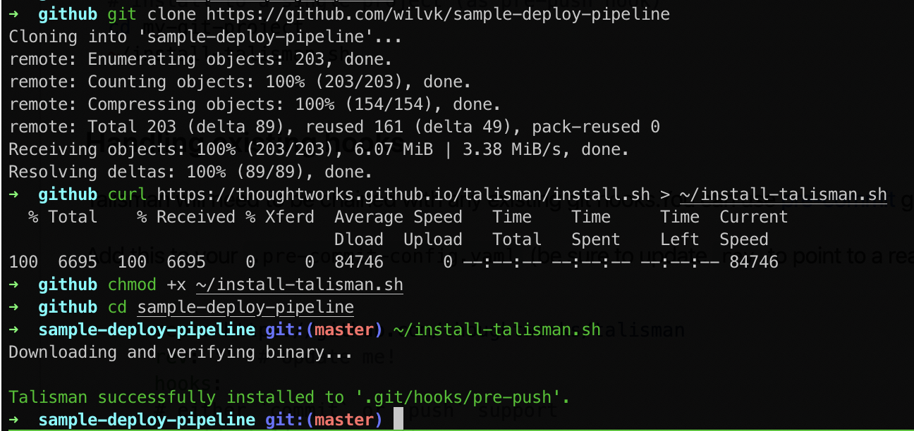

## Talisman

[Talisman](https://github.com/thoughtworks/talisman) is a Secrets Scanning application for git to prevent committing and pushing of secrets to your git source control server.

It works by using git hooks into the local copy of the source code you are working on.

We want to run Talisman on this repository to scan it for secrets.

### Installing Talisman

1. Before we install Talisman, change directory into your forked, cloned repository and make a note of the path.

```bash
$ cd sample-flask-app
$ pwd
/Users/willvk/source/wilvk/sample-flask-application
```

2. Downloading Talisman

Run the following command:

```bash
curl --silent \
https://raw.githubusercontent.com/thoughtworks/talisman/master/global_install_scripts/install.bash \
  -o /tmp/install_talisman.bash && /bin/bash /tmp/install_talisman.bash
```

This command comes from the official [Talisman instructions](https://github.com/thoughtworks/talisman#installation-as-a-global-hook-template
)

It will download and run an install script to load the Talisman binaries for our specific Operating System.

3. Configuring Talisman as a global hook template

At the prompt for what local repositories to add the hook to, enter the path listed by `pwd` above for your repository.

This will prevent it installing Talisman for all the repositories under your home path.

For example:



4. Testing Talisman installed correctly

From the command prompt, enter `talisman`. It should return a list of command options.

If this step fails, verify that Talisman has set an environment variable called `$TALISMAN_HOME` in your bash profile that points to the home path of Talisman on your system. 

This needs to be present in your resource file (`.bashrc`, `.bash_profile`, `.zshrc`, etc) for Talisman to run. You may need to either source your bash profile or restart the terminal to make sure it is there.

You can check it is present by running:

```bash
$ env | grep TALISMAN_HOME
TALISMAN_HOME=/Users/willvk/.talisman/bin
```

If it's not present add it with:

```bash
echo "TALISMAN_HOME=$HOME/.talisman/bin" >> ~/.bashrc
source  ~/.bashrc
```
